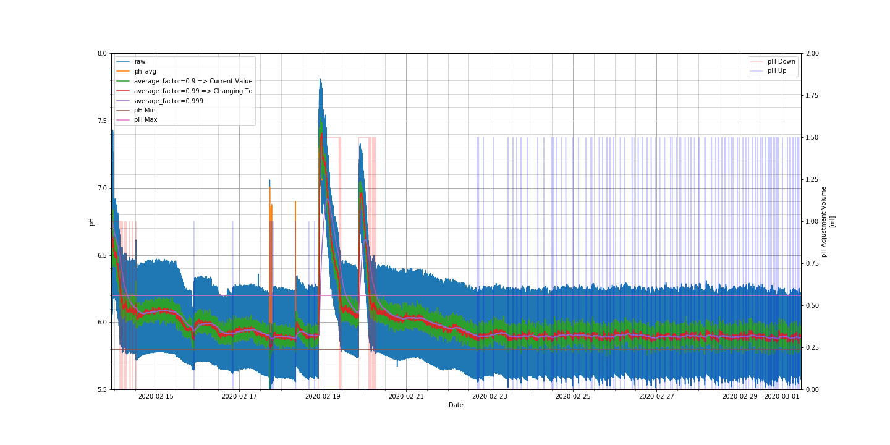

# 20200301
## Controller_ph_Pump:
* dispense_volume has been set at 1.5ml, changing to 3.0ml
 * Analysis shows that 1.5ml causes it to sit right at lower limit for ph, and many doses are required for ph down initially. 
* ph_min has been set at 5.8, changing to 6.0
* ph_max has been set at 6.2, keeping at 6.2
## Sensor_ph:
* average_factor was 0.9, changing to 0.99
 * Want to control to a range of +/-0.1 pH, using average_factor of 0.9 gives swings of +/-0.1.
	Changing to 0.99 will have swings of ~+/-0.02

## ph Plot:
